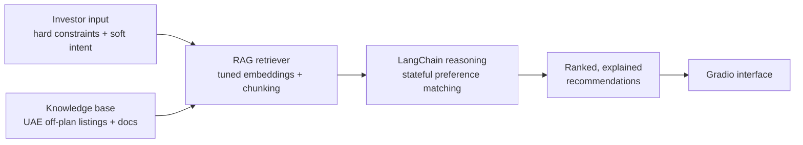

# AI Investment Advisor — UAE Off-Plan Real Estate

A RAG-powered investment advisor for the UAE off-plan property market. It turns an investor's hard constraints (budget, location, handover date) and soft preferences (lifestyle, investment thesis, risk appetite) into real-time, personalised property recommendations, with each suggestion explained against the investor's stated requirements.

> Portfolio project demonstrating retrieval-augmented generation, embedding/chunking evaluation, and stateful LLM workflows applied to a noisy, domain-specific dataset.

---

## How it works



1. **Ingests** UAE off-plan listings and supporting documents into a knowledge base.
2. **Retrieves** the most relevant listings for a given investor profile using a tuned RAG pipeline.
3. **Reasons** over hard + soft preferences with a stateful LangChain workflow to rank and justify matches.
4. **Presents** detailed, explained property profiles through an interactive Gradio interface.

---

## Engineering highlights

- **Retrieval quality, measured.** A/B-tested embedding models and chunking strategies against a labelled set, improving **Precision@K by 18%** and **Recall@K by 22%** over the baseline configuration — retrieval was tuned empirically, not by guesswork.
- **Stateful preference matching.** A LangChain workflow holds investor context across turns and matches listings against both quantitative constraints and qualitative intent.
- **Rapid delivery.** Prototyped in **Gradio**, containerised, and taken to a production deployment on **AWS in two weeks** (Next.js/TypeScript front end + FastAPI back end).

---

## Repository layout

```
gradio_demo.py        Interactive demo UI
property_reco/         Recommendation + matching logic
knowledge-base/        Source documents for retrieval
data/                  Listing data
cn.ipynb               Experimentation / evaluation notebook
tests/                 Unit tests
pyproject.toml         Dependencies (uv)
```

---

## Run the demo

Requires **Python 3.12** and [uv](https://docs.astral.sh/uv/). Add your model/API keys to a `.env` file.

```bash
uv sync
uv run gradio_demo.py
```

---

## Tech stack

| Layer | Choice |
|---|---|
| Language | Python 3.12 |
| LLM orchestration | LangChain |
| Retrieval | RAG (embeddings + chunking, A/B tuned) |
| Demo UI | Gradio |
| Production stack | Next.js / TypeScript + FastAPI on AWS |
| Testing | pytest |

---

## Scope & honesty notes

- Recommendations are decision-support, not financial advice.
- The Gradio app in this repo is the research/demo surface; the production Next.js/FastAPI deployment is described above for context.
